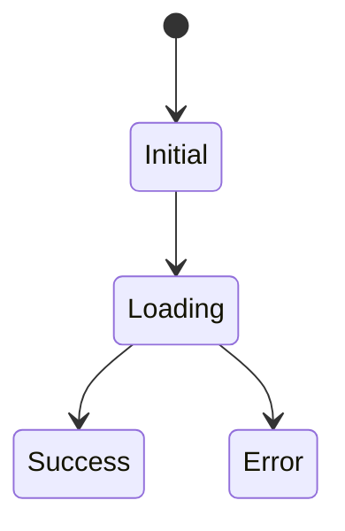

# Overview UI Design

Use this skill to turn an overview design and API design into an implementation-ready UI design document. The usual output is `ui-design.md` beside `overview-design.md`.

## Workflow

1. Locate source documents.
   - Prefer paths named by the user.
   - If no path is given, look for `overview-design.md` in the current project.
   - Read `api-design.md` and `openapi.yaml` when available to align screens with API contracts.
   - Preserve the user's latest chat decisions over older document content.

2. Extract UI-relevant intent.
   - Target users and usage environment.
   - Screen list and user workflows.
   - Domain entities and data shown on each screen.
   - API endpoints used by each screen.
   - Validation, error handling, loading, empty, success, and destructive-action states.
   - Device/browser assumptions and accessibility constraints.

3. Design for the app type.
   - For operational tools, prefer dense but readable layouts, predictable navigation, and efficient repeated actions.
   - Avoid marketing-page structure, oversized hero sections, decorative cards, or explanatory in-app copy.
   - Design first screen as the actual app experience, not a landing page.
   - Keep table-heavy and form-heavy screens ergonomic: filters, bulk actions, inline edits, keyboard-friendly flow where useful.

4. Write `ui-design.md`.
   Include these sections when applicable:
   - UI design goals and assumptions
   - Navigation and screen map
   - Screen-by-screen specifications
   - Layout structure
   - Main components
   - UI states: loading, empty, error, validation, success
   - Forms and validation
   - Tables, filters, sorting, pagination
   - Dialogs and confirmations
   - API mapping by screen
   - Accessibility and responsive behavior
   - Open questions

5. Detail each screen with a consistent template.
   - Purpose
   - Entry points
   - Primary user actions
   - Layout regions
   - Display data
   - Inputs and controls
   - State transitions
   - Validation and errors
   - Related API operations

6. For import or wizard flows, define step states explicitly.
   - Initial state
   - File selected
   - Parsing/loading
   - Preview success
   - Mapping uncertain
   - Validation errors
   - Duplicate detected
   - Import saving
   - Import complete
   - Import failed

7. Validate before finishing.
   - Every screen from the overview design is represented or intentionally deferred.
   - Critical user flows have success and error states.
   - UI actions map to API operations when APIs exist.
   - The design does not assume fixed CSV columns unless the source documents explicitly do.
   - Destructive actions include confirmation behavior.
   - The document is specific enough for frontend implementation to start.

## Output Conventions

Default file name:

- `ui-design.md`

Default location:

- The same directory as the source `overview-design.md`.

Do not overwrite an existing non-empty UI design file blindly. Read it first and preserve useful decisions unless the user asks for a clean rewrite.

## Recommended Screen Sections

Use this compact table for each screen when helpful:

```markdown
| 項目 | 内容 |
|---|---|
| 目的 | ... |
| 主な操作 | ... |
| 主要コンポーネント | ... |
| 主な状態 | loading / empty / error / success |
| 利用API | ... |
```

For complex flows, add a Mermaid state diagram:



## Final Response

Summarize:

- Files created or updated.
- Major UI design decisions.
- Screens or flows intentionally deferred.
- Any assumptions or open questions.
